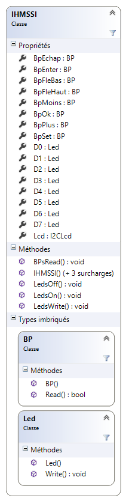
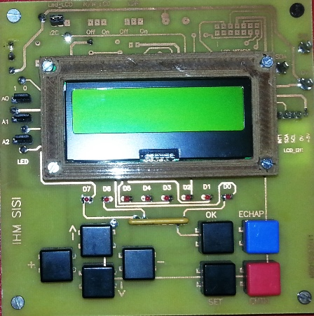

# IHMSSI

## Description

Source code.

A **.NETMF v4.3** class write for IHMSSI personal board.
 1 LCD 2X16 I2C (PCF2119),
 8 LED connected to a PCF8574(A),
 8 buttons connected to a PCF8574(A)

This class is also in the [MicroToolsKit](https://www.nuget.org/packages/WEBGE.Microtoolskit/) **library**. Download at [nuget.org](https://www.nuget.org).

## Hardware

**Targets**: Netduino, Netduino2 plus, Netduino 3, FEZ PANDA 3 et COBRA 3.

## Software

* **Language** : C#
* **Framework used** : .NETMF 4.3
* **IDE** : Visual Studio Community 2015
* **xml** : documentation inside class  
* **Exception** : if transaction failed

## Visual Studio solution

* **IHMSSI**

  * **IHMSSI** : .NetMF class

* **Netduino** : class test program for Netduino board
* **FezPanda** : class test program for Fez Panda board

## Assembly

## Video

To come up

## Keywords

I²C Bus, Netduino, FEZ, PANDA, COBRA, C#, NETMF, Visual Studio.

## Tested on

Fez Panda III, Netduino2 plus

## Todo list

any

## To get started

 [IHMSSI GitHub Pages](http://webge.github.io/IHMSSI/) (French).

Feed on Google+

 <a href="https://plus.google.com/collection/oaaJX" target="_blank">C# embarqué et .NetMF v4.3 : Netduino et GHI FEZ</a> (in French).

Wiki

 <a href="http://webge.dyndnsserver.com/dokuwiki/doku.php?id=netmf43:accueilnetmf" target="_blank">C# embarqué et .NetMF v4.3 pour les cartes Netduino et GHI FEZ</a> (in French).

Project site

 <a href ="http://webge.dyndnsserver.com/dokuwiki/doku.php?id=netmf43:6_microtoolskit" target="_blank">MicroToolsKit library</a> (in English).

Maintened by <a href="mailto:philippemariano@gmail.com">WebGE</a>
